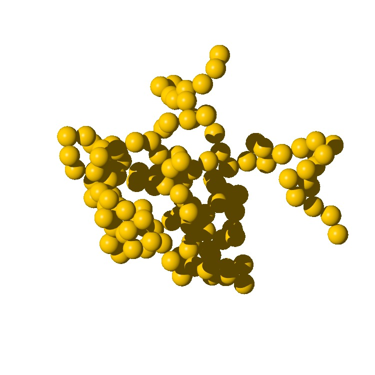

# [PovRay](http://www.povray.org/) model of fractal aerosols
This script render a synthetic image of fractal aerosols.

## Fractal aggregate
Based on [Botet et al. (1995)](http://dx.doi.org/10.1088/0305-4470/28/2/008) we build a collection of fractal aggregates of 1,2,4,8,16,32,64,128,256,512 and 1024 monomers. Their reduce coordinates are stored in a `fractals.db` SQLite database and can be dumped like this:
```bash
sqlite3 fractals.db "SELECT x,y,z FROM Geo_128 WHERE k=7" -header -column
```

Then this database is used by a `python` script to generate a `PovRay` scene:
```bash
python fractals-draw.py 128 7
```


## Synthetic fractal aggregate animation


It is also possible to generate a GIF animation by rotating the camera of the scene and concatenate the output images:
```bash
python fractals-gif.py
sh GIF/create_gif.sh
```

## Dependancy
The following packages are needed to run this code:
- Numpy
- Sqlite3
- [Vapory](https://pypi.python.org/pypi/Vapory/0.1.0) (and [PovRay](http://www.povray.org/) install on the system)

## Resources:
- [Botet et al. (1995)](http://dx.doi.org/10.1088/0305-4470/28/2/008)
- [PovRay](http://www.povray.org/documentation/view/3.6.1/422/)
